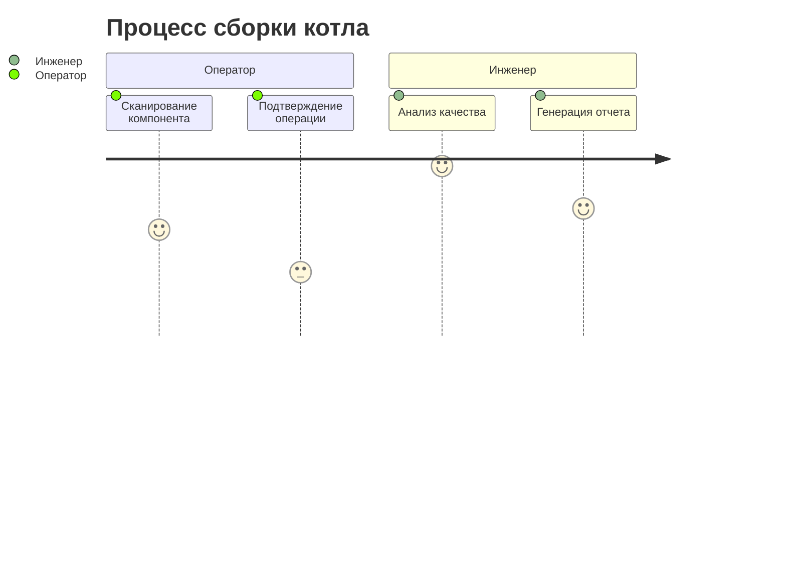

# Контекст продукта

## Бизнес-цели
- Снижение времени на учет компонентов на 40%
- Автоматизация 90% производственной отчетности
- Интеграция с системами ЧПУ станков

## Пользовательские сценарии

## Ключевые метрики
- Время сборки типового узла
- Процент брака на этапах производства
- Загрузка оборудования

## Интеграции
- 1C:Бухгалтерия (экспорт данных)
- CAD системы (импорт моделей)
- Промышленные RFID-сканеры
