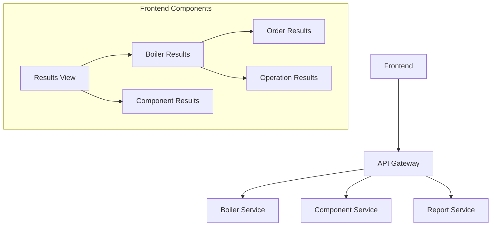
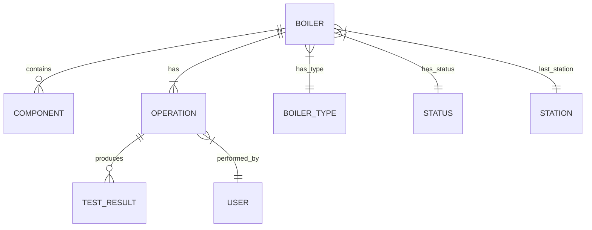

# Архитектурные паттерны

## Микросервисная структура

## Схема данных

## Шаблоны проектирования
- Factory Method для создания отчетов и представлений результатов
- Observer для мониторинга статуса операций
- Composite для работы с компонентами и результатами
- Strategy для различных типов фильтрации и отображения
- Repository для доступа к данным

## Ключевые технические решения
- Material React Table для отображения данных с пагинацией
- WebSocket для real-time обновлений
- DTO маппинг через Vaadin Hilla
- Кэширование состояния компонентов
- Типобезопасные API endpoints
